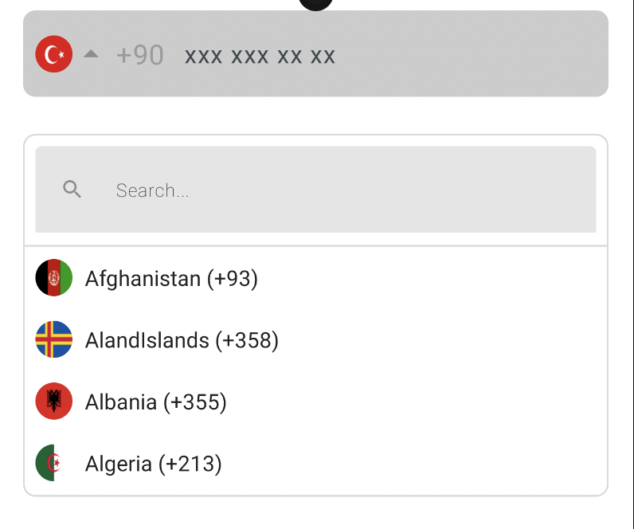

<p align="center">
  
  
  
</p>

<p align="center">
  <a href="https://mailchi.mp/kotlinweekly/kotlin-weekly-389"></a>
  
  
</p>

## CountryCP
Customize your country text field for Jetpack Compose

<p align="start">
 
</p>

<div align="start"> <h3 align="start">GIF</h1> </div>

<p align="start">
 
</p>

## Usage
```kotlin
  val phoneNumber = remember { mutableStateOf("") }
  val showError = remember { mutableStateOf(false) }

  CountryCP(
     modifier = Modifier
      .background(Color.White)
      .fillMaxWidth()
      .padding(horizontal = 16.dp, vertical = 8.dp),
     text = phoneNumber.value,
     shape = RoundedCornerShape(8.dp),
     showError = showError.value,
     errorText = "Enter correct phone number",
     onValueChange = { phoneNumber.value = it },
     phonePlaceholder = {
        Text(text = "xxx xxx xx xx")
      },
     errorTextPaddings = PaddingValues(vertical = 2.dp, horizontal = 16.dp),
     onFullNumberValue = { fullPhoneNumber.value = it },
     phoneFieldColors = OutlinedTextFieldDefaults.colors(
       focusedBorderColor = Color.Red,
       unfocusedBorderColor = Color.Transparent,
       focusedContainerColor = Color.White,
       unfocusedContainerColor = Color.LightGray,
       errorContainerColor = if (showError.value) Color(0xFFFFE5E5) else Color.Transparent
     )
  )

```

## Customize
```python
  modifier -> Arrange your view
  searchModifier -> Arrange your search view
  text -> Set text
  onValueChange -> Use when text changes
  onFullNumberValue -> Get fullnumber value
  shape -> Arrange country field radius
  showCountryCode -> If you want the country code to appear
  showError -> If you want the error to appear
  errorText -> Set error text
  showClearIcon -> If you want clear icon to appear
  focusField -> If you want focus the field
  initialCountryCode -> Arrange initial country
  errorTextPaddings -> Set error label paddings
  phonePlaceholder -> When custom phone placeholder
  searchPlaceholder -> When custom search placeholder
  onClicked -> Get clicked
  phoneFieldColors -> Set your phone field colors
  searchFieldColors -> Set your search field colors
  customRightIcon -> Customize your right icon
```

## Download
> material3 is required.
<details>
  <summary>Groovy</summary>

  ## settings.gradle
  ```gradle
  maven { url 'https://jitpack.io' }
  ```
  ## build.gradle
  ```gradle
  implementation 'androidx.compose.material3:material3:1.1.0'
  implementation 'com.github.tfaki:CountryCP:<latest-version>'
  ```
</details>

<details>
  <summary>Kotlin DSL</summary>

  ## settings.gradle
  ```gradle
  maven(url = "https://jitpack.io")
  ```
  ## build.gradle
  ```gradle
  implementation("androidx.compose.material3:material3:1.1.0")
  implementation("com.github.tfaki:CountryCP:<latest-version>")
  ```
</details>

<div align="start"> <h2 align="start">License</h1> </div>

``` xml

Copyright 2023 tfaki.

Licensed under the Apache License, Version 2.0 (the "License");
you may not use this file except in compliance with the License.
You may obtain a copy of the License at

   http://www.apache.org/licenses/LICENSE-2.0

Unless required by applicable law or agreed to in writing, software
distributed under the License is distributed on an "AS IS" BASIS,
WITHOUT WARRANTIES OR CONDITIONS OF ANY KIND, either express or implied.
See the License for the specific language governing permissions and
limitations under the License.
